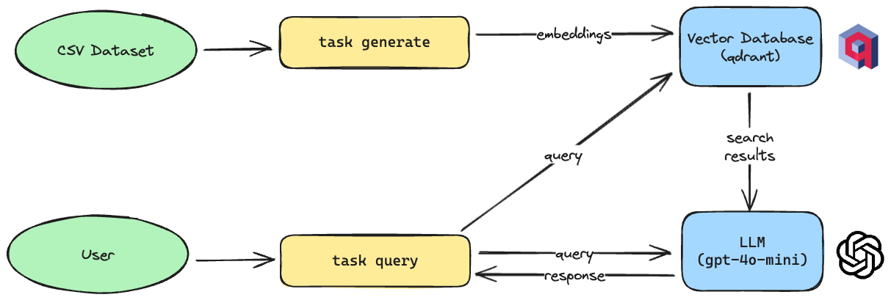

# ⚡️ `rag-demo`

## Overview

This project is a sample demo for the RAG (Retrieval-Augmented Generation) model.
I'm using `gpt-4o-mini` to experiment with the model and used `qdrant` to store the embeddings.
Embeddings are generated using a local LLM from `SentenceTransformers`, which is the `all-MiniLM-L6-v2` model.

The following is the architecture of the project:

<p align="center">
  
</p>

## Acknowledgements

- Duke University's online Coursera course on [Introduction to Generative AI](https://www.coursera.org/learn/intro-gen-ai/).
- [Indonesian Food Recipes Dataset](https://www.kaggle.com/datasets/canggih/indonesian-food-recipes) by [@canggihpw](https://github.com/canggihpw).
- OpenAI for providing the models and the API.

## Requirements

To run this project, you will need to have the following installed on your local machine:
- `python`
- `uv` (recommended)
- `docker`

You will also need to have a working OpenAI API key.
> Feel free to replace the model to a local model if you wish. I tried using [llamafile.ai](https://github.com/Mozilla-Ocho/llamafile) previously and it worked with some modifications to the code.

## Usage

To run the demo, you can use the following command:

```bash
task setup # this will setup the environment + running qdrant via docker
task generate # this will combine the dataset
task query # this will run the RAG process towards the model
```

## Example Output

```console
$ task generate
```

<details>
<summary>Sample Output</summary>

```console
task: [generate] python generate_dataset.py
INFO:root:loading datasets
INFO:root:filtering dataset based on like count >5
INFO:root:count: 8924
INFO:root:saving dataset to parquet
task: [generate] python generate_collection.py
INFO:root:loading dataset
INFO:root:setup clients
INFO:root:deleting existing collection
INFO:root:creating collection
INFO:root:creating embeddings
Batches: 100%|████████████████████████████████████████████████████████████████████████████████████████████████████████████████████████████████████████| 279/279 [00:05<00:00, 49.06it/s]
Batches: 100%|████████████████████████████████████████████████████████████████████████████████████████████████████████████████████████████████████████| 279/279 [00:56<00:00,  4.96it/s]
INFO:root:uploading points
100%|█████████████████████████████████████████████████████████████████████████████████████████████████████████████████████████████████████████████| 8924/8924 [00:03<00:00, 2454.36it/s]
```

</details>

```console
$ task query
```

<details>
<summary>Sample Output 1</summary>

```
task: [query] python query.py
Enter a query: nasi goreng kambing
shape: (5, 4)
┌──────────────────────────┬─────────────────────────────────┬─────────────────────────────────┬───────────┐
│ title                    ┆ ingredients                     ┆ steps                           ┆ score     │
│ ---                      ┆ ---                             ┆ ---                             ┆ ---       │
│ str                      ┆ str                             ┆ str                             ┆ f64       │
╞══════════════════════════╪═════════════════════════════════╪═════════════════════════════════╪═══════════╡
│ Nasi Goreng Kambing      ┆ 2-3 porsi nasi dingin (lebih b… ┆ Panaskan minyak, tumis bumbu h… ┆ 1.0       │
│ Nasi Goreng Kambing      ┆ 3 piring nasi--350 gr daging k… ┆ Tumis semua bumbu sampai harum… ┆ 1.0       │
│ Nasi goreng kambing      ┆ 100 gr daging kambing iris tip… ┆ Uleg bawang putih bawang merah… ┆ 1.0       │
│ Nasi Goreng Kambing      ┆ 8 Butir Bawang merah rajang--6… ┆ Siapkan semua bumbu dan bahan … ┆ 1.0       │
│ Nasi goreng kari kambing ┆ 2 piring nasi--200 gr daging k… ┆ Goreng daging kambing hingga m… ┆ 0.9129615 │
└──────────────────────────┴─────────────────────────────────┴─────────────────────────────────┴───────────┘
**Nasi Goreng Kambing**

**Ingredients:**
- 2-3 servings of cold rice (preferably rice cooked the day before)
- 1 medium bowl of cut lamb curry meat (without sauce)
- 1 small stick of cinnamon
- 1/4 tsp ground pepper
- Sweet soy sauce and salt to taste
- Cooking oil for frying
- Spices (ground):
  - 7 shallots
  - 4 cloves of garlic
  - 4 curly red chilies
  - 2 red bird's eye chilies
  - 2 cardamom pods
  - 1/4 tsp cumin
  - 1/2 tsp coriander
  - 2 cloves
  - 3 cm turmeric
- Complements:
  - Fried shallots to taste
  - Cucumber pickles to taste
  - Emping/crackers to taste

**Steps:**
1. Heat cooking oil, sauté the ground spices and cinnamon stick until fragrant and well cooked.
2. Add the lamb meat, salt, and pepper, mix well.
3. Add the rice, sweet soy sauce, and ground pepper, stir until mixed over high heat.
4. Serve the lamb fried rice topped with plenty of fried shallots and complements.

**Super yummy! 😋**
```

</details>

<details>
<summary>Sample Output 2</summary>

```
task: [query] python query.py
Enter a query: udang goreng saos telor asin
shape: (5, 4)
┌─────────────────────────┬─────────────────────────────────┬─────────────────────────────────┬───────────┐
│ title                   ┆ ingredients                     ┆ steps                           ┆ score     │
│ ---                     ┆ ---                             ┆ ---                             ┆ ---       │
│ str                     ┆ str                             ┆ str                             ┆ f64       │
╞═════════════════════════╪═════════════════════════════════╪═════════════════════════════════╪═══════════╡
│ Udang Goreng Telor Asin ┆ 1/4 udang dikupas--Tepung Kobe… ┆ Goreng udang menggunakan tepun… ┆ 0.8849401 │
│ Udang Goreng Telur Asin ┆ 500 gr udang, kupas kulit--sec… ┆ Cuci bersih udang yang sudah d… ┆ 0.8684114 │
│ Udang Saus Telur Asin   ┆ 500 gram Udang, bersihkan--Bah… ┆ Campur udang dengan bawang put… ┆ 0.824151  │
│ Udang Saus Telur Asin   ┆ 300 gr udang kupas bersih--1 s… ┆ Aduk udang dengan bahan2 pence… ┆ 0.824151  │
│ Udang Saus Telur Asin   ┆ 200 gram Udang Kupas--▶Bahan P… ┆ Panaskan minyak. Celupkan udan… ┆ 0.824151  │
└─────────────────────────┴─────────────────────────────────┴─────────────────────────────────┴───────────┘
**Dish Name:** Fried Shrimp with Salted Egg Sauce

**Ingredients:**
- 500 grams of shrimp, peeled
- Marinade ingredients:
  - 2 cloves garlic, minced
  - Salt, to taste
  - Pepper, to taste
- Coating ingredients:
  - 1 egg, beaten
  - 5 tablespoons flour
  - 1 tablespoon cornstarch
- Sauce ingredients:
  - 3 cloves garlic, finely chopped
  - 1 stalk green onion, sliced
  - Optional red chili, sliced
  - 3 salted egg yolks, crushed
  - Salt, to taste

**Steps:**
1. Combine the shrimp with the minced garlic, salt, and pepper. Marinade for about 30 minutes.
2. Pour the beaten egg over the shrimp and mix well.
3. Dip the shrimp in a mixture of flour and cornstarch, then fry until golden brown. Set aside.
4. For the sauce: sauté the garlic, chili, and green onions until fragrant. Add the crushed salted egg yolks and a little water. Mix well and season with salt. Cook until bubbling.
5. Add the fried shrimp into the sauce and mix quickly.
6. Serve warm. If you prefer more sauce, you can use four salted egg yolks and increase the water accordingly.
```

</details>
<details>
<summary>Sample Output 3</summary>

```
task: [query] python query.py
Enter a query: resep tengkleng kambing
shape: (5, 4)
┌─────────────────────────┬─────────────────────────────────┬─────────────────────────────────┬──────────┐
│ title                   ┆ ingredients                     ┆ steps                           ┆ score    │
│ ---                     ┆ ---                             ┆ ---                             ┆ ---      │
│ str                     ┆ str                             ┆ str                             ┆ f64      │
╞═════════════════════════╪═════════════════════════════════╪═════════════════════════════════╪══════════╡
│ Tengkleng Kambing       ┆ 400 gram iga kambing--500 gram… ┆ Rebus daging dan balungan samp… ┆ 0.902668 │
│ Tengkleng kambing       ┆ Bahan:--1 kg Daging kambing at… ┆ Rebus daging/tulang/jerohan sa… ┆ 0.902668 │
│ Tengkleng kambing       ┆ 1/2 kg daging kambing+tulang--… ┆ Blender bumbu halus... Lalu tu… ┆ 0.902668 │
│ Tengkleng kambing       ┆ 1 kg daging kambing n campuran… ┆ Tumis bumbu yang dihaluskan be… ┆ 0.902668 │
│ Tengkleng kambing manis ┆ 500 gr Iga kambing--1 ruas ser… ┆ Potong2 daging. Iganya dibelah… ┆ 0.832589 │
└─────────────────────────┴─────────────────────────────────┴─────────────────────────────────┴──────────┘
**Dish Name:** Tengkleng Kambing

**Ingredients:**
- 1 kg goat meat or a mix of bones and offals
- 1 liter thin coconut milk
- 500 ml to 1 liter water
- **Ground Spices:**
  - 1 bulb garlic
  - 5 shallots
  - 8 red chilies (to taste)
  - 6 red bird's eye chilies (to taste)
  - 5 candlenuts (lightly toasted)
  - 2 tablespoons coriander
  - 1 cm turmeric
  - 1 cm ginger
  - 1 teaspoon pepper
- **Other Spices:**
  - 2 stalks lemongrass (bruised)
  - 5 bay leaves
  - 2 lime leaves
  - 4 cloves
  - 1 stick cinnamon
  - 5 cloves (optional)
  - 1 star anise (optional)
  - 2 cm galangal (bruised)
  - Salt, palm sugar, and seasoning to taste

**Steps:**
1. Boil the meat, bones, or offals until boiling, then let it sit for about 15 minutes. Discard the water and rinse clean. Set aside.
2. Meanwhile, sauté the ground spices until golden, then add the remaining spices while stirring until fragrant.
3. Add the boiled meat and cook for about 10 minutes until well coated with the spices. Then, add water and cover; let it boil. If it boils, reduce the heat and cook until the meat is tender, approximately 1 to 2 hours. If the meat isn't tender and water reduces, you can add more water.
4. Finally, pour in the thin coconut milk while stirring to prevent it from breaking. Cook until the liquid reduces and the meat stock is well extracted.
5. Don’t forget to taste and adjust the seasoning with salt, palm sugar, and seasoning as needed.
6. Serve garnished with fried shallots and enjoy with white rice.
```

</details>
